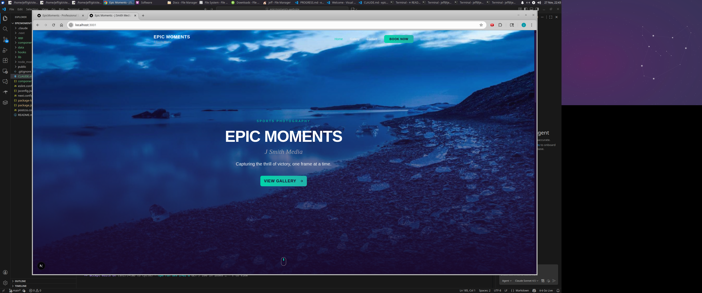

# Epic Moments Website

Marketing website for Epic Moments (J Smith Media), built with Next.js App Router and TypeScript.



## Stack

- Next.js 16
- React 19
- TypeScript
- Tailwind CSS v4
- shadcn/ui
- Lucide React

## Pages

- `/` Home
- `/gallery` Filterable gallery with lightbox
- `/media-day` Media day pricing and packages
- `/contact` Contact form + contact info

## Requirements

- Node.js 20+
- npm

## Local Development

```bash
npm install
npm run dev
```

Open `http://localhost:3000`.

## Scripts

- `npm run dev` Start local dev server
- `npm run lint` Run ESLint
- `npm run build` Create production build
- `npm run start` Serve production build

## Documentation

- Full website and maintenance guide: `docs/WEBSITE.md`
- Project conventions and design notes: `CLAUDE.md`

## Current Limitations

- Contact form submit is simulated client-side
- Image data currently uses placeholder `picsum.photos` sources
- Several components still use native `` rather than `next/image`
